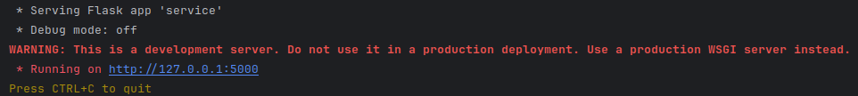
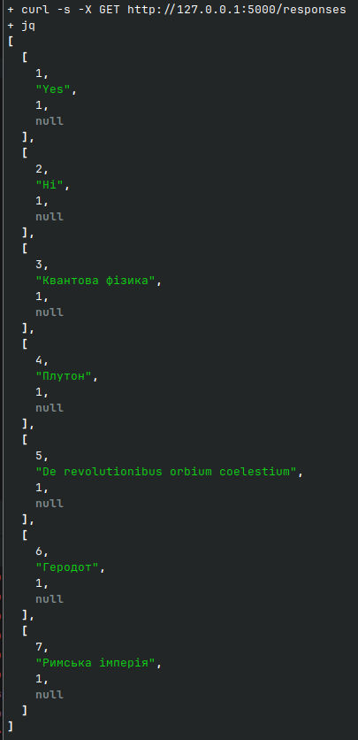
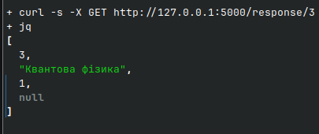
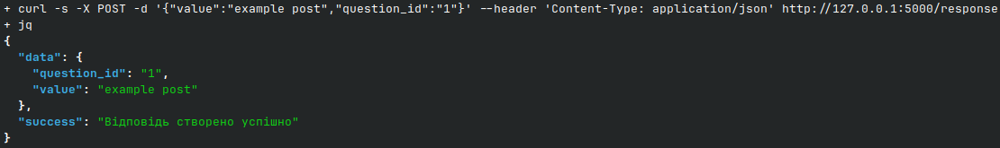
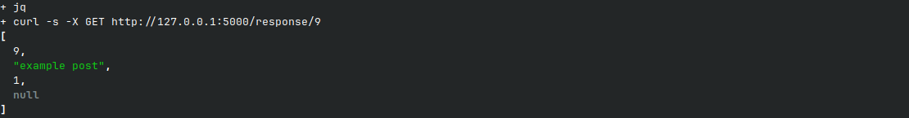
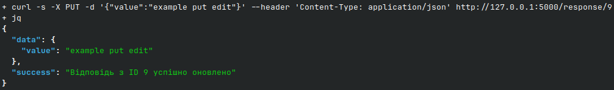
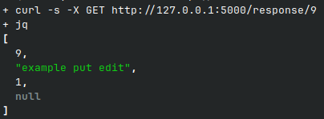
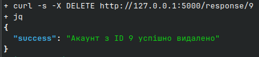
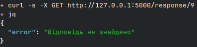

# Тестування працездатності системи

Тестування системи було виконано через надсилання запитів за допомогою програми curl та перевірки отриманих відповідей.

## Запуск сервера
 

## Метод GET
### Отримання усіх відповідей
#### Запит і відповідь
 

### Отримання відповідей за id
#### Запит і відповідь
 

## Метод POST
### Створення відповіді
#### Запит і відповідь
 

#### Перевірка за допомогою GET
 

## Метод PUT
### Зміна відповіді
#### Запит і відповідь
 

#### Перевірка за допомогою GET
 

## Метод DELETE
### Видалення відповіді
#### Запит і відповідь
 

#### Перевірка за допомогою GET
 
 
Можемо бачити, сервіс працює коректно.
